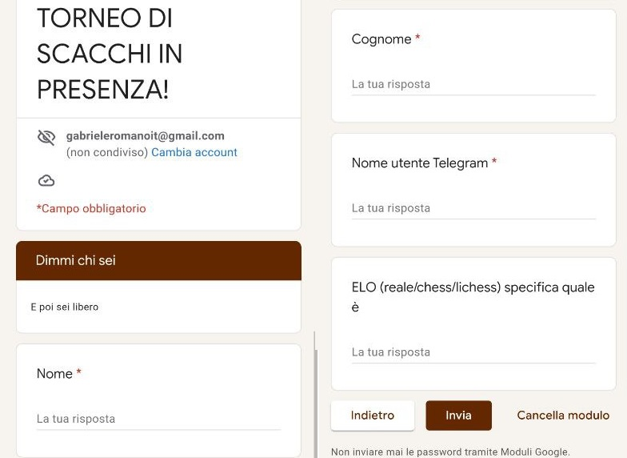
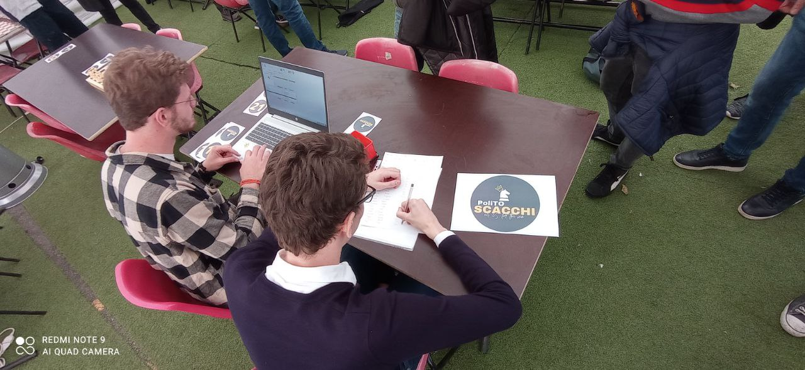
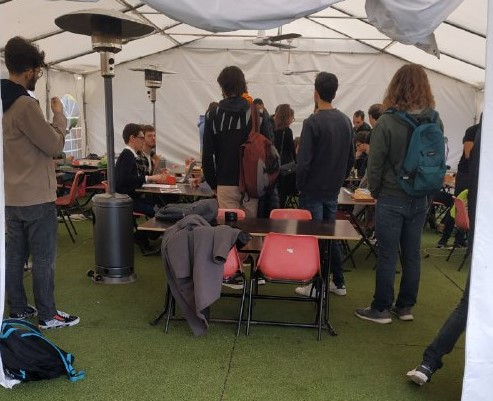

# Milestone 1: Project description and Needfinding: ChessMate

## Overview and planning

We asked an administrator of the "Chess Polito" Telegram group, Emanuele, if he could show us how they organize in person chess games. He described two ways in which they organize in person games: single matches and tournaments. While the organization of single matches is quite simple and linear (he just shares on social media a time and the place where matches will be palyed), he defined the organization of tournaments as long, difficult and prone to mistakes. Therefore, we asked Emanuele if we could follow him along the phases of the organization of a tournament that would have took place in few days, in order to observe the participants and ask them some questions.

## Observation

### 1)

The first observation we performed was a controlled observation: Emanuele reproduced on our request the first steps required for participating in a torunaments.

*Google form to fill when enrolling a tournament*

Any time a tournament is organized, he prepares a Google form for players registration and forwards it on different communication channels (usually Instagram and Telegram). Players fill the form each time they want to enroll a tournament. Among the required information, there is also the players' ELO on one of the principal online applications (like chess.com), that can only be obtained by accessing players' profile. Once registrations are closed, Emanuele transfers the collected data in an Excel sheet by hand and, if a participant wants to resign his registration, he has to contact by message an organizer, that marks in red the Excel row related with him.

Observer's comment: participants fill the same form multiple times with the same informations. A player who wants to resign his registration has to directly contact an organizer and his request is managed manually.

### 2)

The second observation was a naturalistic observation and has been performed in a public place, where the tournament was organized.

*Preliminary tournament phase*

 All the participants must first confirm their presence. To do so, they wait in a line and, when their turn arrives, tell their name to Alessio, another organizer, that marks them on a paper document, in which all information about partecipants are written, and takes the participation fees, that are always paied by cash. Then, Emanuele inserts (by hand) players' information in a software that will be in charge of calculating proper pairings for matches. The payment caused some troubles to some participants, because did no have the possibility to pay with credit cards.

Observer's comment: participants give once again their informations to the organizers and wait a long time in the line, since for each of them it is required to find the corresponding row in the paper document and transfer all the information in a software. This process could be easily automated to delete or, at least, reduce waiting times for participants.

### 3)

Our third observation was performed during the turns of the tournament.

*Queue formed due to manual info managing*

At the start of the turn, an organizer lists (screaming as loud as he can) all the matches by specifying for each of them the players invovled and the board they will play at. At this step, participants must pay attention to what the organizer says, in order to get where they will play, which color they will use and who they will play with. It often happened that some participants did not get their match and asked directly to the organizer to repeat it.

At the end of each turn, a players of each match waits in a line to tell the organizer the result of his game. Also the result are inserted in the software by hand, in order to calculate the pairing of the next turn.

Observer's comment : yelling probably is not the best way to communicate the matches and the results to the participants. Since they are listed one by one, every player must wait until his name is called and those who are distracted or do not hear the voice of the organizer have to ask him again the details of their match. Also communicating directly to the organizer the result of every single match is not the best option, because it leads to more waiting times for the participants, that could be easily avoided with an automated way to communicate.

## Interviews

### Questions

1) How much do you like to participate in tournaments? Is there something you like or dislike in particular? Why?

2) How interested are you in playing tournaments on the board? Why? Would you play more often if the organization was smoother for you?

3) How important is it for you to find tournaments in which the skill level of other participants is around yours? Why? How much does it affect the decision to enroll a tournament rather than another?

4) How much do you think you could improve by playing in person tournaments? Why? At what extent does it affect the decision to enroll a tournament?

5) How do you usually find tournaments? How would you define the process for finding a tournament (easy-normal-difficult)? Why?

6) What is the process you follow for enrolling a tournament? How would you define this process (easy-normal-difficult)? Why? Do you think it could be improved in some way? How?

7) How would you describe the organization to confirm your presence in the tournament and pay the fee? Why? Is there something you think could be improved? How?

8) How was the way in which the organizer told you the matches at the start of each turn? Do you believe it could be easier for participants? Why?

9) How would you define the process you followed for telling the results of your games to the organizers? Why? Did you have any particular issue? Which ones?

10) Are there any questions we did not ask you?

### Answers

Players usually like to play chess tournament in person and define chess as one of their favourite hobby. They usually prefer to play tournaments in person rather than online. The most important reason usually is that they like the direct contact with the opponent, but they also tend to have less distractions (like notifications or calls). Unfortunately, people very rarely manage to find chess tournament on the board, even if they would like to have more opportunities to play, especially to meet new people who play chess.
(1-2)

People believe that there are more efficient ways to improve in playing chess (e.g. playing single games online). However, improvement is not something important for the partitipants when they decide to enroll a tournament, since tournaments are seen more as a way to test one's skills with other players. Participants, infact, said that during a tournament they always manage to find opponents on various level, which tends to align with their own in the last turns.
(3-4)

Peolpe usually find tournaments organized by chess clubs. However, each club publishes the tournaments on his own channels, so it is not immediate to find out about a new tournament; it would be better to see them all together, maybe with the possibility to receive notification and news about them.
(5)

Enrolling a tournament is not something really difficult for the participants, it only requires to fill an online form. However, they think that it would be better to have an account on a platform with all their information to enroll the tournaments, so that they do not have to write them every time. Participants would also prefer to pay their fee and confirm their presence online, rather than wait in a line to do so. Contacting an organizer before or after the enrollment is also a problem: people often do not receive the link for enrolling the tournament directly from the organizer, that can only be reached on telegram or by mai.
(6-7)

On the other hand, the organization of the turn is more complex for the participants, since it has several waiting times. The main issues emerged when the organizer told the matches at the start of the turn, because it was a slow process that was repeated for each turn and it often happened that a participant did not get the information about his next game. Telling the result of the match to an organizer was not an easy task as well, since a game could end in any moment and not always there was an organizer available. Another similar problem emerged during the interviews: some users felt the need to call an arbiter during their match, but it was not easy or possible and it made them lose some time in the game. They think these problems could be solved with a better way to communicate between participants and organizers. An interesting element underlined by a participant is the possibility to access the results of past tournaments.
(8-9)

## User Needs

1) Participants need a way to know when a new tournament is organized

2) Participants need a way to avoid giving their data each time they enroll a tournament

3) Participants need a direct way to contact an organizer of the tournament they are enrolled or want to enroll in

4) Participants need a way to confirm their presence and pay the tournament fee without standing in a line

5) During the different phases of the tournament, participants need an easier way to exchange informations about their matches with the organizers

## Project Description

Our project would aim to simplify the way to participate in a chess tournament, the target population is the participants.
We choose to work on needs 2 and 4.

We identified two strategies to adopt in order to improve the game's experience of the player and reduce the waiting times: simplify the way a player goes through the enrollment steps  (find, register and join a tournament) and speed up the informations exchange between players and organizers during tournament (communicate matches results, get to know next turn details).

The main target device is the smartphone: it is generally used by all the players, it is much more immediate to use and portable compared to other devices, especially during an event such as a tournament to perform quick actions.
