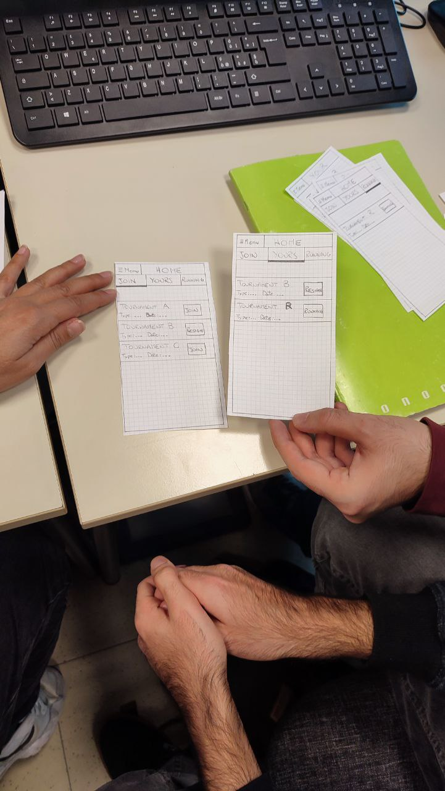

# Milestone 2: Prototyping and Heuristics - ChessMate

## Storyboards

With a basic drawing technique, the storyboard shows in a simplified and direct way when, during the tournament, our application can be used and what user's needs it solves. On the other hand, processes performed by the application are not detailed nor described explicitly. At the end of the storyboard, it is clear that user's need to better live the tournament experience avoiding confusing commincations with the organizer is completely accomplished.

*Complete storyboard*

## Paper Prototypes

The prototypes implement the two main functionalities that sastisfy the user's problems represents in the storyboard.
The process follows the strategy we defined in the project description: the first prototype has a main page from which different functionalities can be accessed, in particular the possibility to enroll in a tournament and to follow the phases of a running tournament.
The second prototype realizes the same functionalities in a more direct way, with no main page and using tabs to move through the different pages of the application.

### Prototype 1

*Home page (center) with pages accessed through buttons "your registrations" (left) and "join tournament" (right)*

*Pop-up form for add some filters to the shown tournaments (sort is similar)*

*Page about tournament informations, can be accessed from every list of tournaments in the previous pages*

*Pages for the running tournament. Can be accessed through the "Running tournament" button in the home page. From left to right, the page before adding the match result, the form to add/modify the result and the page once the result has been added*

### Prototype 2

*In each page the tabs related with one of the functionalities is open. Under each page is reported the page accessed by clicking on a tournament, with its details and the possibility to join/resign it. The drop-down menu is accessible from every page*

*The page for the running tournament with its drop-down menus*

*The running tournament page with the form to add the result*

## Heuristic Evaluation

We only used the two different paper prototypes reported above for the evaluation.

The facilitator explained the aim of the application to the evaluator and described the flow of the main process. Then, with the help of another member of the group (the "computer") that simulated the system, the evaluator tested both the two prototypes, by exploring all the functionalities and trying to reach the final goals: subscribe to a tournament and communicate informations about turn's details in real time.

LanWiz group performed the evaluation, here we transcribed the result they sent us

### Evaluator 1

|Prototype#|Issue#|Heuristic#|Description|Rating|Page Violation|
|---|---|---|---|---|---|
|P1|1|H1|Visibility of the status are good but, in some cases, you are not sure where you are leading when you press back button due to accessibility of an area from 2 different locations.|3|'Join Tournament', 'Your Registrations' and 'Running Tournament'|
|P1|2|H5|When you press join to a tournament it should show user the tournament details. Then the user should press the confirm button to successfully join the tournament.|2|'Join Tournament'|
|P1|3|H8|Prototype 1 shows a lot of details at a time but, prototype 2 had the opportunity to hide and show.|2|'Running Tournament'|
|P2|1|H2|“Running” is a misleading word, and it shouldn’t be placed in there. It should be an indicator that says it is “live” like the app Zoom’s record symbol.|2|'Yours'|
|P2|2|H6|Using symbols like cups or crowns are most-likely have a better impact.|1|'Running'|

### Evaluator 2

|Prototype#|Issue#|Heuristic#|Description|Rating|Page Violation|
|---|---|---|---|---|---|
|P1|1|H1|due to not having a Navbar in some pages there is a possibility of being confused where the user is.|3|'Join Tournament', 'Your Registrations' and 'Running Tournament'|
|P2|1|H2|Choosing a caption of "Running" for a button caused thinking about is it a button? Or a caption for showing status.|3|'Yours'|
|P2|2|H3|the "standing list" is clearly showing the top users in tournament but usually the user is used to seeing a kind of icon to be remember this is exactly based on the result of matches no other criteria.|2|'Running'|

The links of the original files of the evaluations:
[Evaluation - Evaluator 1](./img/Evaluation_Evaluator_1.md)  
[Evaluation - Evaluator 2](./img/Evaluation_Evaluator_2.md)

### Combined evaluation

|Heuristic#|Description|Rating|Page Violation|
|---|---|---|---|
|H1|Having a navigation bar could be helpful to be exactly sure where the user is, since you have multiple options to access to the same page|2|All pages|
|H2|Having the button running was ambigous. Running can be considered as a kind of status. Maybe seeing "active" or "live" could be better|3|Your Tournaments|
|H5|The prototype 1 has a join button for tournaments which can lead to unwanted join actions when the user wants only to see the details of the tournament|2|Join Tournament|
|H6|This is related to the type of standings list. Having a cup icon or a colorful medals wuold be useful in case of not reading "standing list"|1|Running Tournament|
|H8|Prototype 1 seems more complex than prototype 2. The approach of using collapsable drop-down menus is a good idea|1|Running Tournament|

The links of the original files of the evaluations:
[Evaluation - Evaluator 1](./img/Evaluation_Evaluator_1.md)  
[Evaluation - Evaluator 2](./img/Evaluation_Evaluator_2.md)

### Photos of the Evaluations

*Photos from evaluation of first prototype*

*Photos from evaluation of second prototype*

### Potential Changes

After the evaluations and the feedback received, our team decided the potenial changes to implement:

* Mantain the homepage (P1) and the tabs for the navigation (P2).
  * The home page used in prototype 1 can be useful for the users in order to directly choose the functionality they want to use initially; on the other hand, we decided to introduce also the tabs system we designed in prototype 2 for the navigation during the use.
    * Feedback related: Evaluator 1 - P1 - Issue 1, Evaluator 2 - P1 - Issue 1
* Change Label 'Running'.
  * To signal that a tournament is in progress, a more evident label on the tournament box with the "Live" is preferable. The actual label "Running" could be confusing to the the user and is not immediate to understand due to the meaning it wants to convey.
    * Feedback related: Evaluator 1 - P2 - Issue 1, Evaluator 2 - P2 - Issue 1
* Remove Join Button from the list.
  * The Join Button in the rows of the list of the tournaments is repetitive, because this functionality is already available in the page with the tournament details.
    * Feedback related: Evaluator 1 - P1 - Issue 2
* Add Icons.
  * For immediate understanding and for a clearer meaning of some sections, it is convenient to use standard icons.
    For example in the page of Tournament Running it is worth adding the icon of a cup for the standings section.
    As suggested in the feedback, the section with the icon can have a bigger impact.
    * Feedback related: Evaluator 1 - P2 - Issue 2, Evaluator 2 - P2 - Issue 2
* Use Drop-Down Menu.
  * The use of the drop down menu in the Tournament Running Page in the sections of Standings and Turn allows for better readability of the data by the user.
    * Feedback related: Evaluator 1 - P1 - Issue 3

Since its interface is more clean and the srtructure with the home page gives the user an immediate glance of what he can do inside the application, we decided to use the Prototype 1 as main prototype. The changes emerged during the evaluation will be applied, introducing some of the ideas of Prototype 2 (e.g. the tab system and the drop-down menu)
