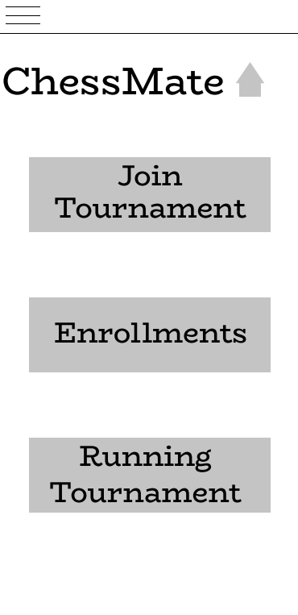
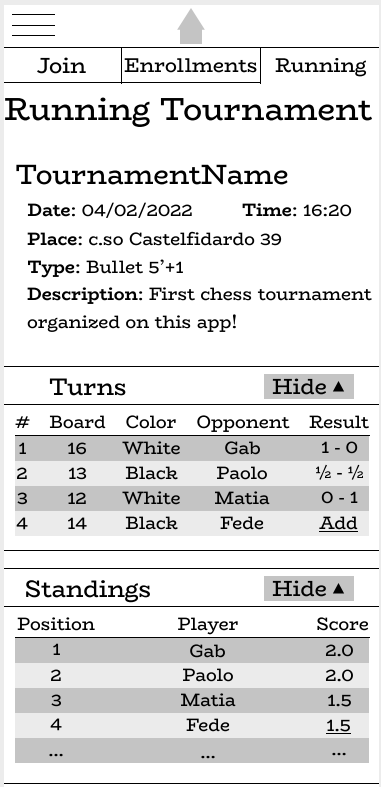

# Milestone 3: Wireframe - ChessMate

## Wireframe

### Wireframe 1 - Home Page

### Wireframe 2 - Running Tournament Page

We used the online tool Figma to create the two medium-fidelity digital wireframes.

From the outcome of Milestone 2 we decided to:

- Combine some features of the two prototypes:

  - Minimal Home Page with the possibility of choosing between the three main pages (Prototype 1). It offers a clear view on the main features in the systems and gives the user a fixed starting point. It is also compliant with traditional applications structure to which most of the users are accustomed
  - Navigation between the three main pages through the three tabs (Prototype 2). It is a faster way to naviagte through the main features of the system and allows the user to his position inside the application's structure. It also provides an easy way to change the page if the wrong button has been clicked in the main page
  - Use of the drop-down menu in the Running Tournament Page for Turns and Standings sections (Prototype 2). The amount of elements on the screen could considerably grow in larger tournament and it could be confusing or annoying for users who are looking for a specific information; in this way, the system interface is more scalable
  - Use of icons for known functions like the menu icon and the home icon (Prototype 1), for helping people recognize them by staying consistent with traditional applications.

- Remove some parts of repeating functions to simplify the complexity of a task execution:

  - Removal of the "join", "resign" and "running" buttons in the rows that display the various tournaments. During the evaluation those button were confusing for the evaluators. We chose to implement more linear and simple path to complete the related tasks
  - Removal of the Logout Button, moving it into the menu section. It is usually hidden in mobile application since users tipically do not use it often. It has been moved in the menu because it is where it is located in most application, therefore users usually expect to find it there
  - Removal of the Organizer function button from the home page. It was meant as a future for specific user that are not our application target. It was said to ignore it during the evaluation but we decided to remove it to prevent users to get confused

The Wireframe 2 represents the page of our protoype that implement the core functionality (M1, User Need 4) to exchange informations and game data during a chess tournament between all players.
The result is an incomplete version of Running Tournament page, in which only the following functions can be performed:

- View all the details of the tournament (name, date, place etc.)
- View the turns and details of the matches that he has played and of the matches that he will have to play (order of matches, chessboard number, color of the pieces, opponents, final score of the previous match)
- Once the single match is over, enter the final score
- View the tournament leaderboard in real time
