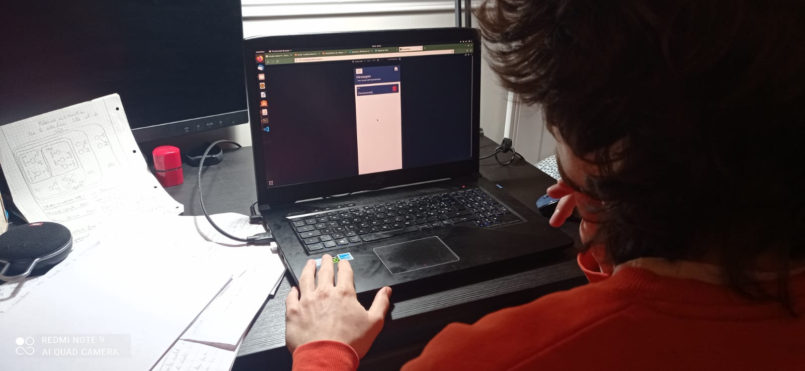
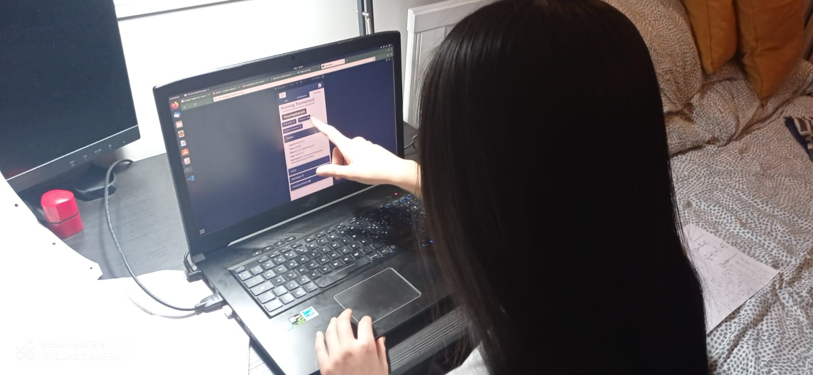
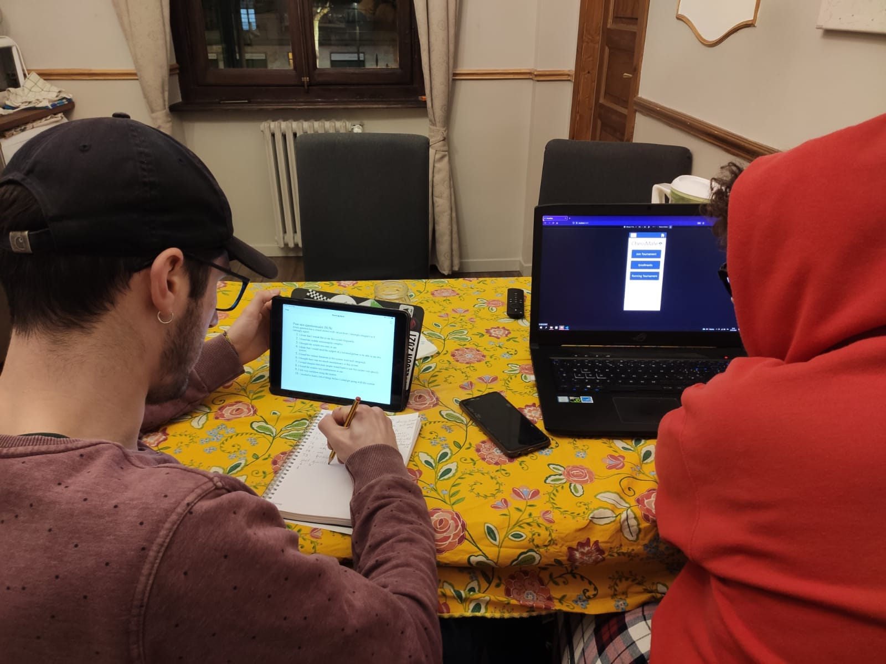
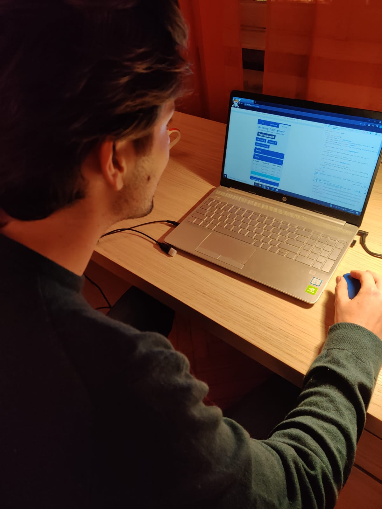

# Milestone 4: Usability Testing - ChessMate

## Overview and Script

We asked on "Chess Polito" Telegram group if some volunteers could help us in conduncting the usability test of our application and contacted 4 interested people. Then, we sheduled with each of them a day and a time to run the test in a physical meeting.

Here is the [Script](./Usability_Script.pdf) produced for the usability testing. It also contains all the artifacts.
Our group split into two teams of two people, each team followed two different sessions. Inside a team, one member acted as the facilitator, while the other acted as observer/note-taker.

First, all the people in charge to test our application have been provided with the pre-questionnaire. Once the pre-questionnaire have been answered, the real usability testing started.

The facilitator, by following the script, explained the participant what he was going to do and how he was supposed to do that.

*Tester trying to find messages exchanged with the organizer*

*Tester looking for the right button to click for resigning from the running tournament*

The order of the tasks was different for each participant, in order to minimize the learning effect in the results.

We decided to apply a methodology for some specific tasks: "Think aloud" was used in tasks 3 and 4, since in those tasks the user acquires information in the system from the interface and it is important to define if he is reading the right information and if he is able to understand it. For tasks 6 and 8, instead, the methodology "Cooperative evaluation" was applied, because they require the participant to pass through more than two pages of the application and it can be useful to know how the user sees the loical structure of the system and if he can understand it by navigating the pages (it was not used for task 9 in order to check if a participant is able to reach such a page by himself).

For task 5 we used a time related metric, infact it is important in the context of a tournament that the refree can be promptly called, since chess games are timed. A metric related with the number of visited pages was applied for tasks 6, 8 and 9, because they require the user to navigate inside the application and it can be useful to take in account how many times a participant chooses the wrong path.

In the end, the participants were required to fill a SUS post-test paper-based questionnaire. Their answers were then collected and analyzed with the associated formula.

*The facilitator writing down tester's impressions about the application*

*Tester trying to find details about his next turn*

## Results and List of Changes

Result from the evaluation are sumarized here for each task :

T1 : The first task's purpose was to join a bullet tournament which takes place during the current week. This task have been successfully completed by all the testers in about 30 seconds. Nevertheless, having just one date as filter was not really helpful, since each day of the week has to be checked for finding the week's tournament in a real scenario with a long list of tournaments.

T2 : The purpose of T2 was to delete the registration for a tournament in which the user is enrolled in. This task has been completed successfully by all the testers in a reasonable amount of time.

T3 : T3 was not so trivial for testers, which needed more than one minute to complete the task. The "details" field in "running tournament" was confusing, and the "Turns" word too.

T4 : T4 has been performed correctly by all the testers in less than 30 seconds.

T5 : T5 was not immediate, it required a bit of time for the testers to figure out which was the correct sequence of actions to perform. Probably this can be a consequence of the problems reported for T3

T6 : finding an advice for a precise tournament was time consuming in some cases. Some testers have found announcements for each tournament in the "Enrollements" or in the "Join" tab directly, while others followed the link in the menu-toggler. In this last case, to find out the correct tournament-announcements mapping, the tester had to open all the announcements one by one.

T7 : calling the arbiter was simple and fast for all the testers.

T8 : all the testers were able to find the path to send a message to organizers in a clear and quick way.

T9 : 3 out of 4 testers have been not able to figure out quickly that messages exchanged with the organizer were in the "Support" session. Probably this name is not very explanatory

T10 : Also for resigning from a running tournament, 2 out of 4 testers found hard to figure out "forfeit" as the right button to click. Again, it is probably just a matter of names.

-------------------------------------------------------------------------------------------------------------------------------------------------------------------------------

In light of the tasks' summary and the answers given by the tester during the post-questionnaire test, we can assert that ChessMate is simple to use, but some features need to be refined. The majority of the testers answered positively to questions related to the ease of use : the learning curve was good, after the first tasks users had a general idea of the application structure, and got always close to accomplish the tasks. Nevertheless, some tasks have not been completed successfully : this enlighted some problems that should be solved. Here a list of changes which could be helpful for improving the application usability :

- Modify the voice "Support" in the menu, maybe with the word "messages"
- Modify the "Forfeit" button with a most common word, e.g. "resign"
- Adding a "back button" to the chat modal, so that the user can get back to the messages' list in one click
- Add a filter to the announcements, or keep in this section just general announcements, while announcements relative to a specific tournament can be accessed through the "join" or "Enrollments" tabs
- Change the filter using a range of dates instead of a single day
- Enlight the row of the current turn in "Turns"
- Enlight the user position in "Standings"
